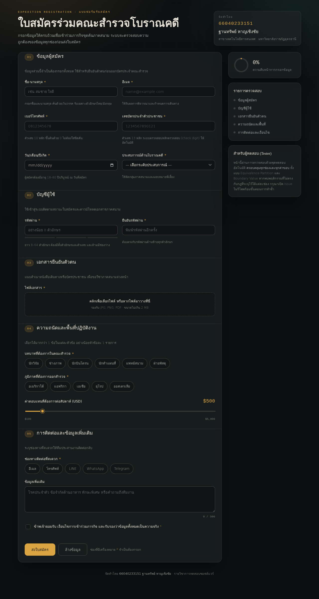

# ใบสมัครร่วมคณะสำรวจโบราณคดี — Expedition Registration Form

แบบฟอร์ม **Input Data** พร้อมระบบตรวจสอบความถูกต้อง (Client-side Validation) แบบเรียลไทม์
จัดทำเป็นแบบฝึกหัดรายวิชา **การทดสอบซอฟต์แวร์ (Software Testing)** โดยออกแบบต่อยอดจากหน้า
[realbugz.com/en/task-form](https://www.realbugz.com/en/task-form)

> **จัดทำโดย** 66040233151 ฐานทรัพย์ หาญเชิงชัย
> สาขาเทคโนโลยีสารสนเทศ · มหาวิทยาลัยราชภัฏอุดรธานี



---

## เปิดใช้งาน

ไฟล์เดียวจบ ไม่ต้องติดตั้งอะไรทั้งสิ้น ไม่ต้องมี build step

```bash
git clone https://github.com/<username>/expedition-form.git
cd expedition-form
# เปิดไฟล์ index.html ด้วยเบราว์เซอร์ได้เลย
```

หรือรันผ่านเซิร์ฟเวอร์ในเครื่อง

```bash
python3 -m http.server 8000
# แล้วเปิด http://localhost:8000
```

### เผยแพร่ด้วย GitHub Pages

1. ไปที่ **Settings → Pages**
2. Source เลือก **Deploy from a branch**
3. Branch เลือก `main` โฟลเดอร์ `/ (root)` แล้วกด Save
4. รอสักครู่ เว็บจะขึ้นที่ `https://<username>.github.io/expedition-form/`

---

## เทคโนโลยีที่ใช้

| ส่วน | รายละเอียด |
|---|---|
| โครงสร้าง | HTML5 ล้วน ไม่พึ่ง framework |
| สไตล์ | CSS3 (Custom Properties, Grid, Flexbox, Backdrop Filter) ธีม Dark + Glassmorphism |
| สคริปต์ | Vanilla JavaScript (ES5-compatible) ไม่มี dependency |
| ฟอนต์ | Noto Serif Thai, IBM Plex Sans Thai, IBM Plex Mono (Google Fonts) |
| ขนาด | ไฟล์เดียว ~44 KB |
| ชุดทดสอบ | Playwright (242 เคส, 2 โซนเวลา) |

---

## ฟีเจอร์

### ช่องรับข้อมูล 15 ช่อง

| # | ช่อง | ชนิด | จำเป็น |
|---|---|---|:---:|
| 1 | ชื่อ-นามสกุล | text | ✔ |
| 2 | อีเมล | email | ✔ |
| 3 | เบอร์โทรศัพท์ | tel | ✔ |
| 4 | เลขบัตรประจำตัวประชาชน | text | ✔ |
| 5 | วัน/เดือน/ปีเกิด | date | ✔ |
| 6 | ประสบการณ์ด้านโบราณคดี | select | ✔ |
| 7 | รหัสผ่าน | password | ✔ |
| 8 | ยืนยันรหัสผ่าน | password | ✔ |
| 9 | ไฟล์เอกสารยืนยันตัวตน | file (drag & drop) | ✔ |
| 10 | บทบาทในคณะสำรวจ | checkbox group | ✔ |
| 11 | ภูมิภาคที่ต้องการออกสำรวจ | checkbox group | ✔ |
| 12 | ค่าตอบแทนต่อสัปดาห์ | range slider | — |
| 13 | ช่องทางติดต่อ | checkbox group | ✔ |
| 14 | ข้อมูลเพิ่มเติม | textarea | — |
| 15 | ยอมรับเงื่อนไข | checkbox | ✔ |

### กฎการตรวจสอบข้อมูล

- **ชื่อ-นามสกุล** — อย่างน้อย 2 คำ ยาว 4–80 ตัวอักษร รับเฉพาะตัวอักษรไทย (ไม่รวมเลขไทย) และอังกฤษ รองรับ `-` และ `'` ในชื่อ ยุบช่องว่างซ้ำให้อัตโนมัติ
- **อีเมล** — ตรวจตำแหน่งจุดและขีดจริง ไม่รับจุดติดกัน จุดนำหน้า/ต่อท้าย หรือโดเมนขึ้นต้นด้วยขีด จำกัดส่วนหน้า 64 ตัว และทั้งอีเมล 254 ตัว
- **เบอร์โทรศัพท์** — ตัวเลข **10 หลักพอดี** ขึ้นต้นด้วย 0 กรองอักขระที่ไม่ใช่ตัวเลขโดยรักษาตำแหน่งเคอร์เซอร์
- **เลขบัตรประชาชน** — 13 หลัก และ**คำนวณหลักตรวจสอบ (check digit) แบบ mod 11 จริง**
- **วันเกิด** — คำนวณอายุจากปี/เดือน/วันจริง (ไม่ใช่ลบเฉพาะปี) ต้องอายุ 18–80 ปีบริบูรณ์ แปลงวันที่เป็นเวลาท้องถิ่นเสมอ จึงให้ผลตรงกันทุกโซนเวลา
- **รหัสผ่าน** — ยาว 8–64 ตัว ต้องมีทั้งตัวอักษรและตัวเลข ห้ามมีช่องว่าง พร้อมมิเตอร์วัดความแข็งแรง 3 ระดับ
- **ยืนยันรหัสผ่าน** — ต้องตรงกับรหัสผ่าน และตรวจซ้ำทันทีเมื่อแก้รหัสผ่านต้นทาง
- **ไฟล์แนบ** — เฉพาะ `.jpg` `.jpeg` `.png` `.pdf` **ตรวจ MIME type ให้ตรงกับนามสกุล** ไม่รับไฟล์ว่าง และขนาดไม่เกิน 2 MB
- **กลุ่มตัวเลือก** — บทบาท / ภูมิภาค / ช่องทางติดต่อ ต้องเลือกอย่างน้อยกลุ่มละ 1 รายการ
- **ค่าตอบแทน** — จำกัดช่วง 100–5,000 USD ทั้งตอนแสดงผลและก่อนส่ง แม้ถูกแก้ค่าผ่าน DevTools
- **ข้อมูลเพิ่มเติม** — ไม่เกิน 300 ตัวอักษร นับแบบ code point ให้ตรงกับตัวนับบนหน้าจอ
- **เงื่อนไข** — ต้องติ๊กยอมรับก่อนส่งใบสมัคร

ข้อความผิดพลาดทุกข้อความบอกค่าที่ตรวจพบจริง เช่น "เบอร์โทรศัพท์ต้องมี 10 หลักพอดี (ตอนนี้ 9 หลัก)"

### ประสบการณ์ผู้ใช้

- ตรวจสอบทันทีเมื่อออกจากช่อง (blur) และแก้สถานะทันทีขณะพิมพ์แก้ไข
- แสดงกรอบเขียว/แดง พร้อมข้อความอธิบายเป็นภาษาไทยรายช่อง
- วงแหวนแสดงความคืบหน้าเป็น % และ checklist 5 หมวดที่อัปเดตตามการกรอก
- อัปโหลดไฟล์ด้วยการลากมาวาง พร้อมแสดงชื่อและขนาดไฟล์
- กดส่งแล้วข้อมูลไม่ครบ จะเลื่อนไปยังช่องแรกที่ผิด พร้อมเอฟเฟกต์สั่นและโฟกัสให้อัตโนมัติ
- ส่งสำเร็จแสดงหน้าสรุปข้อมูล โดยปิดบังเลขบัตรประชาชนบางส่วน
- ปุ่มล้างข้อมูลรีเซ็ตค่า สถานะ ข้อความผิดพลาด สไลเดอร์ ตัวนับ และไฟล์แนบทั้งหมด
- หน้าสรุปกักโฟกัสไว้ในหน้าต่าง คืนโฟกัสเดิมเมื่อปิด และปิดปุ่มส่งระหว่างเปิดเพื่อกันส่งซ้ำ
- รองรับคีย์บอร์ดเต็มรูปแบบ มี focus ring ชัดเจน ผูก `aria-describedby` / `aria-invalid` / `aria-live` ให้ทุกช่อง และรองรับ `prefers-reduced-motion`
- Responsive ตั้งแต่มือถือถึงจอเดสก์ท็อป

---

## การทดสอบ

โปรเจกต์นี้มาพร้อมชุดทดสอบอัตโนมัติ **242 เคส** ครอบคลุมทุกช่องกรอก ทุกค่าขอบ (Boundary Value)
ทุกคลาสสมมูล (Equivalence Partition) การส่ง/ล้างฟอร์ม การเข้าถึง และการแสดงผลบนจอ 375px
โดยรันซ้ำใน 2 โซนเวลา (`Asia/Bangkok` และ `America/Los_Angeles`) เพื่อยืนยันว่าการคำนวณอายุไม่คลาดเคลื่อน

```bash
npm install --no-save playwright
npx playwright install chromium
node tests/validation.test.js
```

ผลล่าสุด: **ผ่าน 242 / 242**

เอกสารประกอบการทดสอบ

- ตารางเทสเคสสำหรับทดสอบด้วยมือ → [`docs/TEST-CASES.md`](docs/TEST-CASES.md)
- แบบฟอร์มรายงานข้อผิดพลาด → [`docs/BUG-REPORT-TEMPLATE.md`](docs/BUG-REPORT-TEMPLATE.md)
- รายการแก้ไขทั้งหมด → [`docs/CHANGELOG.md`](docs/CHANGELOG.md)

หากพบพฤติกรรมที่ไม่ตรงกับกฎที่ระบุไว้ใต้แต่ละช่อง เปิด Issue พร้อมขั้นตอนการทำซ้ำได้เลย

---

## โครงสร้างไฟล์

```
expedition-form/
├── index.html                    เว็บฟอร์มทั้งหมด (HTML + CSS + JS ในไฟล์เดียว)
├── README.md
├── LICENSE
├── tests/
│   └── validation.test.js        ชุดทดสอบอัตโนมัติ 242 เคส (Playwright)
└── docs/
    ├── screenshot.png
    ├── TEST-CASES.md             ตารางเทสเคสสำหรับทดสอบด้วยมือ
    ├── BUG-REPORT-TEMPLATE.md    แบบฟอร์มรายงานบั๊ก
    └── CHANGELOG.md              บันทึกการแก้ไขทุกเวอร์ชัน
```

## สัญญาอนุญาต

เผยแพร่ภายใต้สัญญาอนุญาต MIT — ดูรายละเอียดในไฟล์ [LICENSE](LICENSE)
